# ☁️🏠 hybrid-edge

[](https://badge.fury.io/py/hybrid-edge)
[](https://www.python.org/downloads/)
[](https://opensource.org/licenses/MIT)

**Turn your local GPU into a Global AI Cloud Node.**

`hybrid-edge` is a professional Python SDK that securely exposes local AI models (like Ollama) to the public internet. It uses **Cloudflare Tunnels** for secure ingress and **GitHub Gists** for automatic Service Discovery, allowing you to connect to your home AI server from anywhere without static IPs or dangerous port forwarding.

---

## 🏗️ Architecture

```mermaid
graph LR
    Client["📱 Python Client / SDK"] -- 1. Where is the server? --> Gist["GitHub Gist (Phonebook)"]
    Gist -- 2. Returns URL --> Client
    Client -- 3. Secure HTTPS Request --> Cloudflare["☁️ Cloudflare Edge"]
    Cloudflare -- 4. HTTP2 Tunnel --> PC["🏠 Local PC (HybridServer)"]
    PC -- 5. Auth Check --> Flask["🛡️ Security Guard"]
    Flask -- 6. Forward --> Ollama["🦙 Local LLM"]
```



## ✨ Features

* **Zero Port Forwarding:** Uses Cloudflare Tunnels (HTTP2) to bypass firewalls securely.
* **Auto-Discovery:** Automatically updates a GitHub Gist with your dynamic URL on startup.
* **Security Guard:** Built-in Flask proxy enforces Bearer Token authentication.
* **Hybrid SDK:** Use it as a CLI tool (`hybrid-client`) or import it into your Python code (`from hybrid_edge import HybridLLM`).
* **Auto-Healing:** Detects stale tunnels and automatically reconnects.

---

## 📦 Installation

```bash
pip install hybrid-edge
```

*Note: You must have [Ollama](https://ollama.com/) installed and running on your server machine.*

---

## 🔑 Configuration

You need to provide your secrets via environment variables. Create a `.env` file in your project root (or set them in your system environment).

**Required Variables:**

| Variable | Description |
| :--- | :--- |
| `SECRET_KEY` | A password you invent (e.g., `sk-1234`). Clients must provide this to connect. |
| `GIST_ID` | The ID of a secret GitHub Gist (filename `tunnel.json`). |
| `GITHUB_TOKEN` | A GitHub Personal Access Token with `gist` scope permissions. |

**Optional Variables:**

| Variable | Default | Description |
| :--- | :--- | :--- |
| `FLASK_PORT` | `5000` | The port the security proxy runs on. |
| `OLLAMA_PORT` | `11434` | The port Ollama is running on. |

---

## 🚀 Usage: CLI Tools

The library comes with two terminal commands for instant use.

### 1. Start the Server (On your GPU Machine)
This will auto-download the Cloudflare binary, start the tunnel, and update your Gist.

```bash
hybrid-server
```

### 2. Start the Client (On any machine)
This connects to the Gist, finds your server, and opens a chat interface.

```bash
hybrid-client
```

---

## 💻 Usage: Python SDK

You can integrate `hybrid-edge` directly into your own Python applications (Django, Flask, Scripts).

### Client Side (Consuming the Model)

```python
from hybrid_edge import HybridLLM
import os

# Initialize connection
ai = HybridLLM(
    username="<YOUR_GITHUB_USERNAME>",
    gist_id=os.getenv("GIST_ID"),
    secret_key=os.getenv("SECRET_KEY")
)

# Generate text
response = ai.generate(
    prompt="Explain Quantum Computing in simple terms.",
    model="llama3.2"
)

print(response)
```

### Server Side (Hosting the Model)

If you want to run the server from a Python script instead of the CLI:

```python
from hybrid_edge import HybridServer

server = HybridServer(
    secret_key="my-super-secret-key",
    port=5000
)

# This blocks forever and keeps the tunnel open
server.start()
```

---

## 🛠️ Troubleshooting

**Error: `Tunnel connection died (530)`**
* **Cause:** The server URL changed, but the Client is using an old URL cached in the Gist.
* **Fix:** Restart `hybrid-server` to force a Gist update, then restart your client.

**Error: `Invalid Secret Key (403)`**
* **Cause:** The `SECRET_KEY` in your client's `.env` does not match the server's `.env`.
* **Fix:** Ensure both files have the exact same key.

**Error: `Phonebook is empty`**
* **Cause:** The server hasn't finished starting up yet.
* **Fix:** Wait until you see `✅ Service Discovery Updated!` in the server terminal.

---

## 📄 License

MIT License. See [LICENSE](LICENSE) for details.
